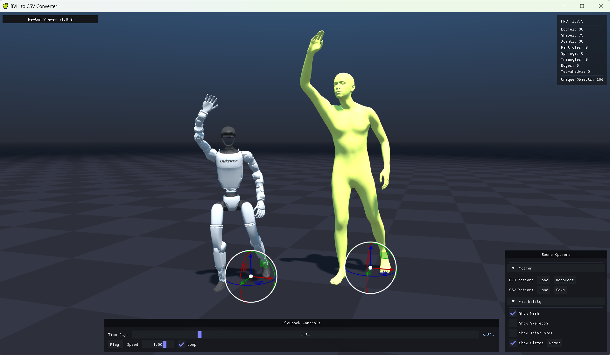

# SOMA Retargeter
[](https://opensource.org/licenses/Apache-2.0)


Convert [SOMA](https://github.com/NVlabs/SOMA-X) human motion captures into humanoid robot joint animation. Takes BVH motion files as input and produces robot-playable CSV joint data as output using GPU-optimized inverse kinematics via [Newton](https://github.com/newton-physics/newton) and high-performance computation with [NVIDIA Warp](https://github.com/NVIDIA/warp).

- Contact-aware foot IK extension (optional): uses virtual toe/heel anchors plus inferred or loaded contact scores to reduce foot sliding without requiring physical toe joints.

The retargeting pipeline handles proportional human-to-robot scaling, multi-objective IK solving with joint limits, optional feet stabilization, and per-DOF joint limit clamping. SOMA is the input skeleton; target robots are registered in `params.py` and selected with `--robot`.

SOMA Retargeter is part of the [SOMA body model](https://github.com/NVlabs/SOMA-X) ecosystem for humanoid motion data.

> **Note:** This project is in active development. The API may change between releases as the design is refined.

## Demo


[Full MP4 demo](assets/docs/roboparty-rpo-retargeted-dance-demo.mp4)

## Requirements

- **Python:** 3.12
- **Git LFS:** Installed and initialized for asset downloads
- **OS:** Windows (x86-64) and Linux (x86-64, aarch64)
- **GPU:** NVIDIA GPU (Maxwell or newer), driver 545+ (CUDA 12). No local CUDA Toolkit installation required.

## Installation

<details>

<summary>Setup instructions</summary>

### Method 1 (conda + pip)

#### 1. Create and Activate Conda Environment

```bash
conda create -n soma-retargeter python=3.12 -y
conda activate soma-retargeter
```

#### 2. Download LFS Assets

```bash
git lfs pull
```

#### 3. Install the Library

```bash
pip install .
```

### Method 2 (uv)

#### 1. Install uv

Follow the [official installation guide](https://docs.astral.sh/uv/getting-started/installation/) if `uv` is not yet installed.

#### 2. Download LFS Assets

```bash
git lfs pull
```

#### 3. Sync the Project

`uv sync` creates an isolated `.venv` virtual environment inside the project directory, installs the correct Python version and resolves all dependencies.

```bash
uv sync
```

### Platform-specific notes

**Note (Linux):** For the GUI viewer to work, install `tkinter`

```bash
sudo apt-get install python3.12-tk
```

**Note (Windows):** If `imgui-bundle` fails to install, the Microsoft Visual C++ Redistributables may be missing. Download from the [official Microsoft documentation](https://learn.microsoft.com/en-us/cpp/windows/latest-supported-vc-redist).

</details>

## Motion Data

This repo includes 10 sample BVH/CSV pairs in `assets/motions/` for immediate testing.

For large-scale motion data, see the [SEED dataset](https://huggingface.co/datasets/bones-studio/seed) (Skeletal Everyday Embodiment Dataset) published by [Bones Studio](https://huggingface.co/bones-studio). SEED provides a large-scale collection of human motions on the SOMA uniform-proportion skeleton, which is the expected input format for this tool. The G1 robot motion data included in SEED was retargeted using SOMA Retargeter.

## Quick Start

> When using **uv** (Method 2), replace `python` with `uv run` in the commands below.

### Interactive viewer (OpenGL)

```bash
python ./app/bvh_to_csv_converter.py --viewer gl --robot roboparty_rpo
```



The viewer displays the source SOMA motion alongside the retargeted robot in a 3D viewport. Use the right panel to load BVH files, run retargeting, and save CSV output. Playback controls at the bottom allow scrubbing, speed adjustment, and looping. Toggle visibility of the skinned mesh, skeleton, joint axes, and positioning gizmos.

### Batch conversion (headless)

Process a folder of BVH files without a display. Set `import_folder` and `export_folder` in the config file, then run:

```bash
python ./app/bvh_to_csv_converter.py --viewer null --robot roboparty_rpo
```

Batch mode recursively finds all `.bvh` files in the import folder, processes them in configurable batch sizes, and writes CSV files to the export folder mirroring the input directory structure.

### Retargeting v2 autoconfig

New robots should first go through the morphology-aware profile compiler. Register the robot MJCF/XML and minimal semantic `ik_map` in `params.py`, then run:

```bash
python -m soma_retargeter.tools.autoconfigure_robot --robot roboparty_rpo
```

Useful validation modes:

```bash
python -m soma_retargeter.tools.autoconfigure_robot --robot roboparty_rpo --validate-only --strict
python -m soma_retargeter.tools.autoconfigure_robot --robot roboparty_rpo --force --output ./profile_v2.json
```

The compiler writes a schema v2 profile with deterministic JSON, explicit `xyzw` quaternion order, robot/source fingerprints, semantic sites, chain reachability placeholders, task specs, contact settings, confidence, and structured warnings. Low-confidence semantic mappings return exit code `2`; invalid model/config input returns exit code `3`.

Generated runtime configs now include a `compiled_retarget_profile` reference. Advanced users can override its path with `COMPILED_RETARGET_PROFILE_DICT` in `params.py`; otherwise the registry uses `<robot>_compiled_retarget_profile_v2.json` beside the retargeter config.

When a v2 profile is present, runtime mapping is task-driven: disabled or unreachable position/orientation tasks are not instantiated as legacy IK objectives.
Runtime weights are resolved from the compiled profile's priority bands (`0: 1e4` through `4: 1` by default) and include diagnostics if adjacent priority ratios fall below the required 10x separation.
For reachable low-rank rotation tasks, the runtime projects target quaternions into the compiled rotation basis before updating Newton rotation objectives.
Middle-limb direction tasks are run as unit-vector IK objectives between compiled parent/child robot bodies. Pole-vector tasks use parent/middle/child bend-plane normals with per-environment source fallback to the previous or neutral normal. Mixed analytic/autodiff Jacobian mode is enabled only when these v2 residuals are active.
The runtime scaler also switches to segment-local target construction from the compiled chain lengths, while the legacy geocentric scaler remains available as `LegacyHumanToRobotScaler`.
Joint safety uses a range-normalized margin barrier for the warm-up smooth filter path: finite non-continuous joints have near-zero residual inside the safe margin and monotonic residual growth near either limit; the final clamp remains a numerical safeguard.
Temporal velocity and acceleration regularizers are available through `temporal_velocity_weight` and `temporal_acceleration_weight`. They are disabled by default for backward compatibility, and when enabled they normalize actuated joint deltas by joint range and each clip's sample rate while skipping the floating root coordinates.

### Config optimizer

Register the robot files in `params.py`, then launch the optimizer:

```bash
python ./app/pose_optimizer_ui.py --viewer gl --robot roboparty_rpo
```

The optimizer is now an advanced residual calibration path. The default path is to generate a v2 profile from robot morphology and a minimal semantic map; paired robot poses in `POSE_PAIR_JSON_DICT` should only be used for bounded refinement when the compiled profile already validates.

## Code Overview

### `app/`

| File | Description |
|------|-------------|
| `bvh_to_csv_converter.py` | Main entry point. Drives both interactive and headless batch retargeting modes. |
| `pose_optimizer_ui.py` | Generic GUI for optimizing generated scaler configs from paired poses. |
| `optimize_scaler_config.py` | Headless paired-pose scaler optimization logic used by the GUI. |

### `soma_retargeter/`

| Module | Description |
|--------|-------------|
| `robot_registry_parser.py` | Expands the minimal `params.py` robot registration into runtime configs. |
| `animation/` | Core data structures for skeletons, animation buffers, IK, and skinned meshes. |
| `assets/` | File I/O for BVH, CSV, and USD formats. |
| `pipelines/` | Retargeting pipeline: IK solving, feet stabilization, and joint limit clamping. |
| `pipelines/ik_objectives.py` | Custom IK objectives for per-env contact anchors, v2 direction and pole-vector tasks, range-normalized joint-limit barriers, and temporal regularizers. |
| `robotics/` | Human-to-robot scaling and robot output formatting. |
| `robotics/human_to_robot_scaler.py` | Legacy v1 scaler plus v2 segment-local target builder. |
| `robotics/task_compiler.py` | Morphology-aware v2 task/profile compiler. |
| `robotics/reachability.py` | Reachability basis, projector, and projected rotation utilities. |
| `tools/autoconfigure_robot.py` | CLI for compiling deterministic v2 robot retargeting profiles. |
| `renderers/` | Visualization for the interactive viewer. |
| `utils/` | Math, pose, coordinate conversion, Newton and Warp helpers. |
| `configs/` | Minimal robot link maps and paired pose files; generated scaler/converter configs are created on first use. |

## Related Work

SOMA Retargeter is a support tool within the SOMA ecosystem for humanoid motion data:

* [SOMA Body Model](https://github.com/NVlabs/SOMA-X) - Parametric human body model with standardized skeleton, mesh, and shape parameters
* [GEM-X](https://github.com/NVlabs/GEM-X) - Human motion estimation from video
* [Kimodo](https://github.com/nv-tlabs/kimodo) - Kinematic motion diffusion model for text and constraint-driven 3D human and robot motion generation
* [ProtoMotions](https://github.com/NVlabs/ProtoMotions) - GPU-accelerated simulation and learning framework for training physically simulated digital humans and humanoid robots
* [SONIC](https://nvlabs.github.io/GEAR-SONIC/) - Whole-body control for humanoid robots, training locomotion and interaction policies

## Acknowledgments

This project draws inspiration and builds upon excellent open-source work, including:
* [GMR](https://github.com/YanjieZe/GMR) - General Motion Retargeting
* [PyRoki](https://pyroki-toolkit.github.io/) - A Modular Toolkit for Robot Kinematic Optimization

## License

This codebase is licensed under [Apache-2.0](LICENSE).

This project will download and install additional third-party open source software projects. Review the license terms of these open source projects before use.
